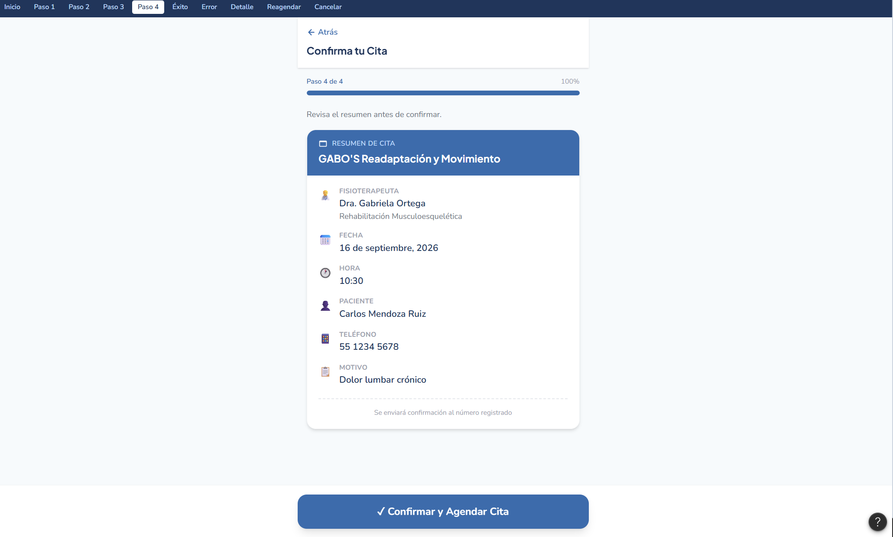
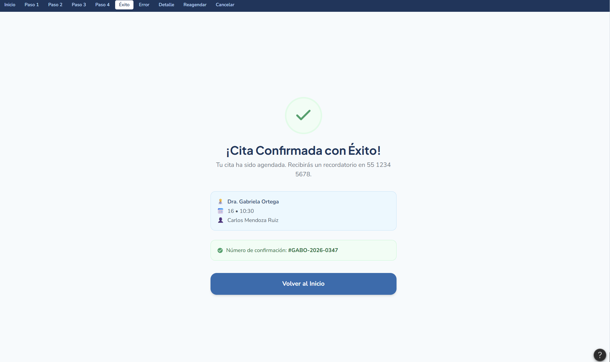
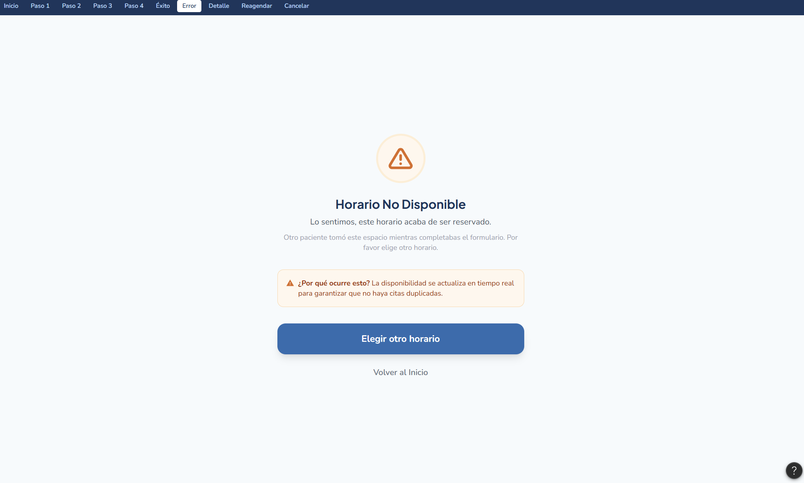

# Prueba Práctica 1 - Interacción Humano-Computador (IHC)
**Caso de estudio:** Diseño HCI de un mecanismo para la gestión de citas - GABO'S Readaptación y Movimiento.

## Repositorio
**Enlace:** [https://github.com/Boris2403/Prueba_Practica_IHC_1](https://github.com/Boris2403/Prueba_Practica_IHC_1)

##  Integrantes, usuarios y roles

| Apellidos y Nombres | Usuario GitHub | Rol |
| :--- | :--- | :--- |
| **Vinces Cueva Boris Yussef** | [@Boris2403](https://github.com/Boris2403) | Desarrollador Frontend |
| **Mora Beltrán Santiago Sebastián** | [@Santio13-code](https://github.com/Santio13-code) | Tester |
| **Acaro Ibujés Pedro Sebastián** | [@sebastianyiyi](https://github.com/sebastianyiyi) | Desarrollador Backend |
| **González Álvarez Vladimir Humberto** | [@VladAlz](https://github.com/VladAlz) | QA |

## Issues y commits por integrante

* **Boris Yussef Vinces Cueva (Frontend):** Creación de *issues* para la estructura de vistas; *commits* enfocados en el diseño y maquetación de pantallas del prototipo interactivo.
* **Santiago Sebastián Mora Beltrán (Tester):** *Issues* orientados a la lógica de requerimientos y pruebas; *commits* con la redacción de la matriz de comparación de mecanismos y análisis de actores.
* **Pedro Sebastián Acaro Ibujés (Backend):** *Issues* de métricas de usabilidad; *commits* registrando las tablas de indicadores de eficiencia y los registros del protocolo de pruebas.
* **Vladimir Humberto González Álvarez (QA):** *Issues* de control de calidad y revisión de formato; *commits* consolidando el análisis del flujo AS-IS y la verificación general del informe final.

## Pull Requests y revisión cruzada

* **PR #1 (Flujo AS-IS):** Creado por Vladimir Humberto González Álvarez (QA) ➔ Revisado y aprobado por Santiago Sebastián Mora Beltrán (Tester).
* **PR #2 (Matriz de Mecanismos):** Creado por Santiago Sebastián Mora Beltrán (Tester) ➔ Revisado y aprobado por Pedro Sebastián Acaro Ibujés (Backend).
* **PR #3 (Prototipo HCI):** Creado por Boris Yussef Vinces Cueva (Frontend) ➔ Revisado y aprobado por Vladimir Humberto González Álvarez (QA).
* **PR #4 (Indicadores y Validación):** Creado por Pedro Sebastián Acaro Ibujés (Backend) ➔ Revisado y aprobado por Boris Yussef Vinces Cueva (Frontend).

## Reflexión grupal

> El desarrollo de esta práctica permitió comprender cómo la Interacción Humano-Computador transforma un proceso fragmentado en una solución digital centrada en el usuario. A través del análisis riguroso del flujo AS-IS en GABO'S Readaptación y Movimiento, identificamos puntos críticos de fricción que afectaban a pacientes y fisioterapeutas. La aplicación de metáforas de interfaz adecuadas y un prototipo interactivo facilitaron la materialización de un modelo híbrido de agendamiento, reduciendo la carga administrativa y previniendo conflictos de horarios. El trabajo colaborativo mediante control de versiones en GitHub garantizó una coherencia absoluta entre los problemas detectados y las soluciones metodológicas plasmadas en el informe. (104 palabras)

## Justificación de Issue 1

* **Responsable:** Vladimir Humberto González Álvarez (QA)
* **Descripción:** Subida y justificación analítica del boceto de la Pantalla de Inicio (Dashboard).
* **Justificación del diseño:** La pantalla de inicio muestra dos opciones principales de gran tamaño[cite: 1]. Con esta distribución se aplica la Ley de Hick para minimizar las opciones disponibles para el usuario[cite: 1]. Además, se aplica la Ley de Fitts al proporcionar áreas táctiles expansivas[cite: 1]. El objetivo de estas decisiones es garantizar que destaque un diseño limpio y directo[cite: 1].

## Justificación Issue 2:
## Issue 2: Interfaces de Confirmación y Notificaciones

### 1. Evidencia Visual (Figuras 6 a la 8)

* **Figura 6 - Pantalla de Confirmación:**
  

* **Figura 7 - Cita Confirmada con Éxito:**
  

* **Figura 8 - Horario No Disponible:**
  

---

### 2. Documentación de Diseño y Usabilidad

#### Heurística: Reconocimiento antes que recuerdo
La interfaz evita que el usuario tenga que memorizar los datos seleccionados en pasos previos (como la fecha, el médico o el servicio). En la pantalla de confirmación (**Figura 6**), todos los datos clave se muestran de forma explícita y visible, permitiéndole verificar la información de un solo vistazo antes de emitir la acción final.

#### Retroalimentación inmediata del comprobante
Una vez que el usuario presiona confirmar, el sistema responde de manera instantánea generando un resumen visual o comprobante de éxito (**Figura 7**). Esta respuesta inmediata elimina la incertidumbre y confirma de forma inequívoca que la transacción o reserva se ha registrado correctamente en la base de datos.

#### Ruta de recuperación ante errores
Si el usuario intenta apartar un espacio que ya fue ocupado o que no se encuentra habilitado, el sistema despliega una alerta clara de *Horario No Disponible* (**Figura 8**). Lejos de dejar la pantalla estancada o generar un error crítico, la interfaz provee una ruta de retorno directa para que el usuario pueda corregir su elección de forma fluida sin perder su progreso.

## Justificación de Issue 3

### 1. Evidencia Visual (Figuras 9 a la 11)

* **Figura 9 - Detalle de Cita:**
  

* **Figura 10 - Confirmar Nuevo Horario:**
  

* **Figura 11 - Modal de cancelacion:**
  

---

## 2. Documentacion

* **Responsable:** Santiago Sebastián Mora Beltrán (Tester)
* **Descripción:** Subida y justificación analítica de los bocetos de Detalle de Cita, Reagendamiento y Modal de Cancelación.
* **Justificación del diseño:** En la vista de Detalle de Cita se aplica la Ley de Proximidad para agrupar visualmente la información relevante del paciente y el terapeuta. Para la vista de Reagendamiento, la interfaz permite una comparación visual directa entre el estado actual y el nuevo horario, facilitando la toma de decisiones del usuario. Finalmente, el Modal de Cancelación implementa la heurística de prevención de errores de Nielsen, requiriendo una confirmación explícita antes de ejecutar una acción destructiva.

## Justificación de Issue 4

* **Responsable:** Pedro Sebastián Acaro Ibujés (Desarrollador Backend)
* **Descripción:** Documentación analítica del contexto operativo actual, matriz de usuarios y necesidades, definición de metáforas de interfaz, análisis de reducción de carga cognitiva, conclusiones y recomendaciones para pruebas empíricas.

### 1. Documentación Analítica

#### Contexto Actual (WhatsApp, Google Drive y Agenda Física)
El centro de fisioterapia **GABO'S Readaptación y Movimiento** opera de forma fragmentada:
* Las historias clínicas se gestionan en documentos de una carpeta compartida en **Google Drive**.
* La agenda de citas se coordina de manera manual vía **WhatsApp** y en una **agenda física**.
* No existen reportes o indicadores centralizados para monitorear el proceso.

#### Tabla de Usuarios y Necesidades (Actividad 2)

| Rol / Usuario | Necesidad / Objetivo | Punto de Fricción (Problema Actual) |
| :--- | :--- | :--- |
| **Paciente** | • Agendar una cita médica de forma rápida. • Conocer horarios disponibles sin esperar respuesta. | Dependencia de la respuesta manual por WhatsApp y tiempos de espera prolongados. |
| **Fisioterapeuta** | • Atender a los pacientes sin cruce de horarios. • Visualizar su agenda diaria consolidada. | Horarios gestionados en agenda física, propensos a duplicidad de citas y errores de transcripción. |
| **Personal Administrativo** | • Gestionar eficientemente los espacios del centro. • Contar con un sistema unificado sin transcripción manual. | Acciones duplicadas entre la comunicación por WhatsApp y el registro en la agenda física. |

---

### 2. Metáforas, Usabilidad y Resultados (Commit 2)

#### Metáforas de Interfaz (Actividad 5)

| Metáfora | Componente UI / Pantalla | Justificación y Funcionamiento |
| :--- | :--- | :--- |
| **Calendario de escritorio** | Selector de Fecha (Grid) — *Paso 2* | Muestra días del mes; bloquea días pasados o sin disponibilidad (Mapeo natural). |
| **Tarjeta de presentación** | Selector de Fisioterapeuta — *Paso 1* | Muestra foto, nombre y especialidad, facilitando el reconocimiento sobre el recuerdo. |
| **Recibo / Ticket** | Resumen de Cita — *Paso 4* | Condensa la información antes de la confirmación final de la reserva. |

#### Reducción de Carga Cognitiva y Principios HCI
* **Visibilidad del estado del sistema:** Incorporación de una barra de progreso superior (Paso 1 al 4).
* **Leyes de Hick y Fitts:** Reducción de opciones en el Dashboard inicial a botones masivos para minimizar el tiempo de decisión.
* **Higiene en Formularios y Accesibilidad (A11y):** Etiquetas de campos ubicadas fuera de los inputs para evitar dependencia de placeholders.
* **Prevención de Errores:** Confirmación modal previa a acciones destructivas (cancelación) y pantalla de error con ruta de recuperación inmediata.

#### Conclusiones
* Reemplazar la gestión tradicional (WhatsApp y agenda física) por un sistema de autoagendamiento o híbrido elimina cruces de agenda y reduce la carga administrativa de los 5 fisioterapeutas.
* El prototipo demuestra que se puede lograr simplicidad funcional y solidez técnica aplicando un mapeo visual adecuado.

#### Recomendaciones
* Ejecutar pruebas de usabilidad empíricas con usuarios reales (pacientes y personal) aplicando el protocolo de la Actividad 7 para medir tiempos de éxito y tasas de error antes de la etapa de programación Backend/Frontend.